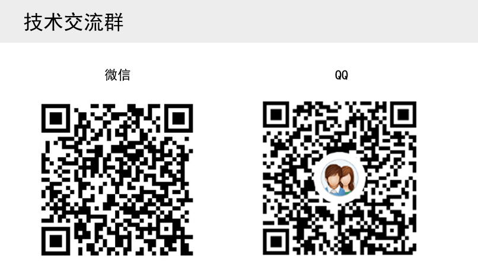

swagger-bootstrap-ui
=========================
[](https://maven-badges.herokuapp.com/maven-central/com.github.xiaoymin/swagger-bootstrap-ui)

## 简介

`swagger-bootstrap-ui`是`Swagger`的前端UI实现,目的是替换`Swagger`默认的UI实现`Swagger-UI`,使文档更友好一点儿....

`swagger-bootstrap-ui` 只是`Swagger`的UI实现,并不是替换`Swagger`功能,所以后端模块依然是依赖`Swagger`的,需要配合`Swagger`的注解达到效果,[注解说明](swagger-annotation.md)

在线效果体验:[http://swagger-bootstrap-ui.xiaominfo.com/doc.html](http://swagger-bootstrap-ui.xiaominfo.com/doc.html)

## 功能


* 接口文档说明,效果图如下：


* 在线调试功能,效果图如下:


## demo演示

[swagger-bootstarp-ui-demo](http://git.oschina.net/xiaoym/swagger-bootstrap-ui-demo)

## 下载

`swagger-bootstrap-ui`下载地址：[下载](http://git.oschina.net/xiaoym/swagger-bootstrap-ui/releases)

## 使用说明

* 首先需要引入swagger的配置包信息,如下：


```java
<dependency>
 <groupId>io.springfox</groupId>
 <artifactId>springfox-swagger2</artifactId>
 <version>2.2.2</version>
</dependency>
<!-- 这里swagger-ui是swagger的默认实现,这个jar可以不用引入,使用下面的swagger-bootstrap-ui替代--->
<dependency>
 <groupId>io.springfox</groupId>
 <artifactId>springfox-swagger-ui</artifactId>
 <version>2.2.2</version>
</dependency>
```


* maven项目中引用`swagger-bootstrap-ui`的jar包依赖,如下：


```java
<dependency>
  <groupId>com.github.xiaoymin</groupId>
  <artifactId>swagger-bootstrap-ui</artifactId>
  <version>1.6</version>
</dependency>
```

* Spring项目中启用swagger,代码如下：


1.注解方式

```java
@Configuration
@EnableSwagger2
public class SwaggerConfiguration {

 @Bean
 public Docket createRestApi() {
     return new Docket(DocumentationType.SWAGGER_2)
     .apiInfo(apiInfo())
     .select()
     .apis(RequestHandlerSelectors.basePackage("com.bycdao.cloud"))
     .paths(PathSelectors.any())
     .build();
 }

 private ApiInfo apiInfo() {
     return new ApiInfoBuilder()
     .title("swagger-bootstrap-ui RESTful APIs")
     .description("swagger-bootstrap-ui")
     .termsOfServiceUrl("http://localhost:8999/")
     .contact("developer@mail.com")
     .version("1.0")
     .build();
 }
}
```

* `swagger-bootstrap-ui`默认访问地址是：`http://${host}:${port}/doc.html`


## 注意事项

* swagger封装给出的请求地址默认是`/v2/api-docs`,所以`swagger-bootstrap-ui`调用后台也是`/v2/api-docs`,不能带后缀,且需返回json格式数据,框架如果是spring boot的可以不用修改,直接使用,如果是Spring MVC在web.xml中配置了`DispatcherServlet`,则需要追加一个url匹配规则,如下：


```java
<servlet>
   <servlet-name>cmsMvc</servlet-name>
   <servlet-class>org.springframework.web.servlet.DispatcherServlet</servlet-class>
   <init-param>
   <param-name>contextConfigLocation</param-name>
   <param-value>classpath:config/spring.xml</param-value>
   </init-param>
   <load-on-startup>1</load-on-startup>
</servlet>
<!--默认配置,.htm|.do|.json等等配置-->
<servlet-mapping>
	<servlet-name>cmsMvc</servlet-name>
 	<url-pattern>*.htm</url-pattern>
</servlet-mapping>
<!-- 配置swagger-bootstrap-ui的url请求路径-->
<servlet-mapping>
   <servlet-name>cmsMvc</servlet-name>
   <url-pattern>/v2/api-docs</url-pattern>
</servlet-mapping>

```
## 鸣谢

特别感谢以下大牛开发的js/css、html前端框架，美观、易用

| 框架          | 网站                                       |
| ----------- | ---------------------------------------- |
| *jquery*    | [http://jquery.com/](http://jquery.com/ "http://jquery.com/") |
| *bootstrap* | [http://getbootstrap.com](http://getbootstrap.com "http://getbootstrap.com") |
| *layer*     | [http://layer.layui.com/](http://layer.layui.com/ "http://layer.layui.com/") |
| *jsonview*  | [https://github.com/yesmeck/jquery-jsonview](https://github.com/yesmeck/jquery-jsonview "https://github.com/yesmeck/jquery-jsonview") |

## 交流




